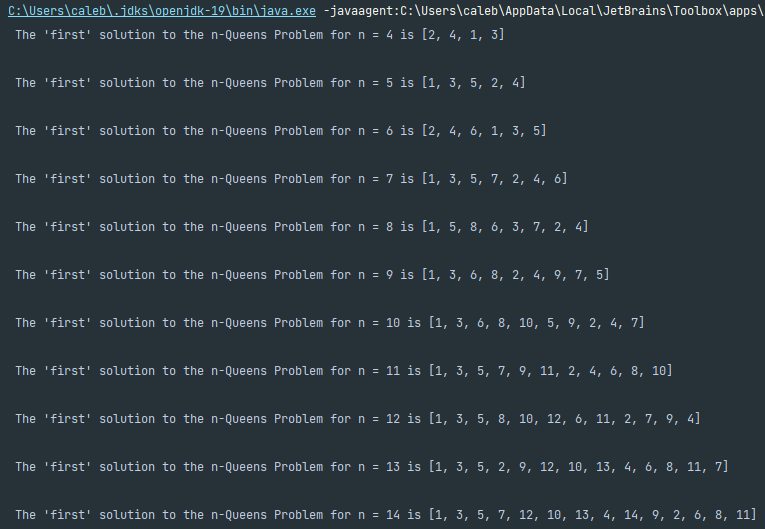

<!-- # HW 6 -->
## General
- **All snapshots are in the "Images" folder outside the src folder**
- There are test variables to test main functions in `Main.java`. 
- 
## Part 1: `isLegalPosition(int[] intPosition,int n)`

- ints[] are used to  represent 1-index based locations.
- in this function, length is synonymous with size (n = 8 board has "size" 8 here, NOT 64)
- 
# Part 2: `nextLegalPosition(int[] intPosition,int n)`
- when an array has no next valid position, you will just receive an array of 0s

## Part 3: `question3()`
- Name of snapshot "question3Output"
- 
## Part 4: `question4()`
- Name of output snapshot: "question4Output"
- 
